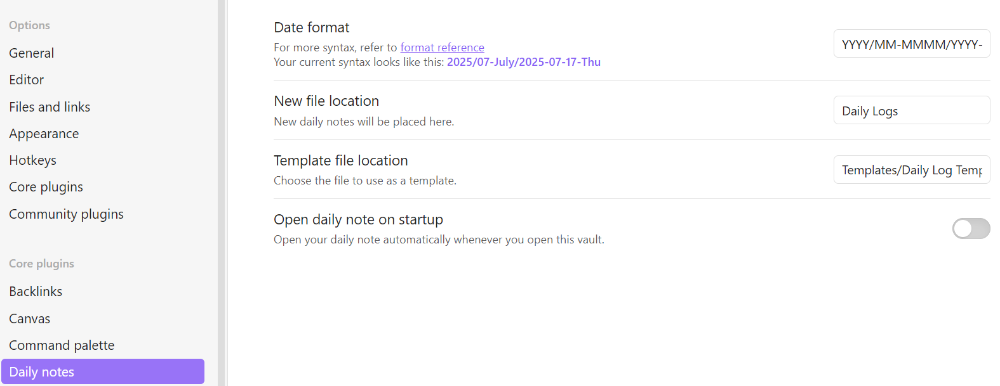

# Obsidian-Setup
My personal Obsidian system for structured daily notes, using Templater automation for consistent formatting and navigation.


## 📦 What's included

- `Daily Log Template.md`  
  Template for new daily notes based on today's date. Automatically inserts:
  - Properly formatted header (e.g., `# Thursday July 17`)
  - 📅 Navigation links to Yesterday and Tomorrow
  - Placeholder for notes or journaling

- `Historical Daily Log Template.md`  
  Cleans up imported notes (e.g., from Evernote), replacing any incorrect H1 with the correct one from the filename and standardizing layout. Features:
  - Removal of incorrect H1 headers
  - Accurate 📅 navigation links
  - Consistent spacing before note content


## 🗂 Assumed folder structure

```
Daily Logs/
└── 2025/
   └── 07-July/
      └── 2025-07-17-Thu.md
```

Each note is named `YYYY-MM-DD-Weekday.md` and organized in year/month subfolders.

## ⚙️ Required Obsidian settings

1. **Install the [Templater plugin](https://github.com/SilentVoid13/Templater)** from Community Plugins and enable it.
2. Go to **Settings → Daily notes** and configure:
   - **Date format**: `YYYY/MM-MMMM/YYYY-MM-DD-ddd`
   - **New file location**: `Daily Logs`
   - **Template file location**: `Templates/Daily Log Template.md`

This ensures each daily note is automatically placed in the correct subfolder for the corresponding year/month.




## ✅ How to use

1. Place both templates in your `Templates/` folder within your Obsidian vault.
2. Set `Daily Log Template.md` as your default Daily Note template in Obsidian settings.
3. Run `Templater: Replace templates in active file` for imported historical notes (e.g., from Evernote) using the cleanup template.


## 🚨 Logic for dates in the header and navigation links

- For **new daily notes**, the current system date (when the note is created) determines the header and navigation links.
- The file name drives all logic **for historical notes**, not the written header. This means you should import historical notes named as `YYYY-MM-DD-Weekday.md` (e.g., `2025-07-12-Sat.md`). The [Calendar plugin](https://github.com/liamcain/obsidian-calendar-plugin) or tools like [Bulk Rename Utility](https://www.bulkrenameutility.co.uk/) can help you rename files in batch to match this format.
- If you're backfilling a note for a past date, you can manually override the templated header and links by adjusting the filename before running the template (e.g., rename the file to `2025-07-10-Thu.md` so it generates the correct header and navigation).
